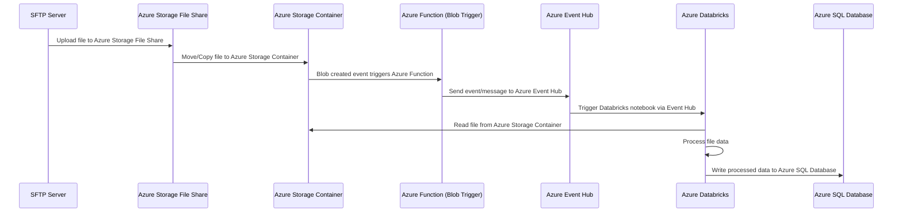

# Data-Ingestion-into-Databricks
Data Ingestion. Databricks Lakehouse


### Using TensorFlow with Parquet Files

First, ensure you have the necessary libraries installed:

```bash
pip install tensorflow pandas pyarrow
```

#### Example Workflow in TensorFlow

1. **Reading Parquet Files:**
   Use `pandas` to read the Parquet file into a DataFrame.
   
2. **Converting DataFrame to TensorFlow Dataset:**
   Convert the pandas DataFrame to a TensorFlow Dataset for further processing and training.

```python
import pandas as pd
import tensorflow as tf

# Step 1: Read Parquet file into a DataFrame
df = pd.read_parquet('data.parquet')

# Step 2: Convert DataFrame to TensorFlow Dataset
def df_to_dataset(dataframe, shuffle=True, batch_size=32):
    dataframe = dataframe.copy()
    labels = dataframe.pop('target')  # assuming 'target' is the label column
    ds = tf.data.Dataset.from_tensor_slices((dict(dataframe), labels))
    if shuffle:
        ds = ds.shuffle(buffer_size=len(dataframe))
    ds = ds.batch(batch_size)
    return ds

batch_size = 32
dataset = df_to_dataset(df, batch_size=batch_size)

# Step 3: Use the dataset for model training
model = tf.keras.models.Sequential([
    tf.keras.layers.Dense(64, activation='relu'),
    tf.keras.layers.Dense(1)  # assuming a regression task
])

model.compile(optimizer='adam', loss='mean_squared_error')
model.fit(dataset, epochs=10)
```

### Using PyTorch with Parquet Files

First, ensure you have the necessary libraries installed:

```bash
pip install torch pandas pyarrow
```

#### Example Workflow in PyTorch

1. **Reading Parquet Files:**
   Use `pandas` to read the Parquet file into a DataFrame.
   
2. **Creating a PyTorch Dataset:**
   Convert the DataFrame into a PyTorch Dataset.

```python
import pandas as pd
import torch
from torch.utils.data import Dataset, DataLoader

# Step 1: Read Parquet file into a DataFrame
df = pd.read_parquet('data.parquet')

# Step 2: Create a custom PyTorch Dataset
class ParquetDataset(Dataset):
    def __init__(self, dataframe):
        self.dataframe = dataframe
        self.features = dataframe.drop('target', axis=1).values  # assuming 'target' is the label column
        self.labels = dataframe['target'].values

    def __len__(self):
        return len(self.dataframe)

    def __getitem__(self, idx):
        features = torch.tensor(self.features[idx], dtype=torch.float32)
        label = torch.tensor(self.labels[idx], dtype=torch.float32)
        return features, label

# Step 3: Create DataLoader
batch_size = 32
dataset = ParquetDataset(df)
dataloader = DataLoader(dataset, batch_size=batch_size, shuffle=True)

# Step 4: Define a simple model
model = torch.nn.Sequential(
    torch.nn.Linear(df.shape[1] - 1, 64),  # number of features minus label
    torch.nn.ReLU(),
    torch.nn.Linear(64, 1)  # assuming a regression task
)

# Step 5: Define loss function and optimizer
criterion = torch.nn.MSELoss()
optimizer = torch.optim.Adam(model.parameters(), lr=0.001)

# Step 6: Training loop
for epoch in range(10):  # number of epochs
    for features, labels in dataloader:
        optimizer.zero_grad()
        outputs = model(features)
        loss = criterion(outputs, labels.view(-1, 1))
        loss.backward()
        optimizer.step()
    print(f'Epoch {epoch+1}, Loss: {loss.item()}')
```

Certainly! Below is a detailed description and a Mermaid sequence diagram that illustrates a use case involving the following components:

- **SFTP Server**: A source that provides files.
- **Azure Storage File Share**: A storage solution to temporarily hold files from SFTP.
- **Azure Storage Container**: A storage container where files are uploaded after processing.
- **Azure Function Blob Trigger**: Monitors the Azure Storage Container and triggers processing when a new file is uploaded.
- **Azure Event Hub**: Receives events/messages triggered by the Azure Function.
- **Azure Databricks**: Processes the file after receiving a message from Azure Event Hub.
- **Azure SQL Database**: Stores the processed data.

### **Use Case Flow:**

1. **File Upload to SFTP**:
   - A file is uploaded to the SFTP server.

2. **File Transfer to Azure Storage File Share**:
   - The file is transferred from the SFTP server to Azure Storage File Share, where it is stored temporarily.

3. **File Movement to Azure Storage Container**:
   - The file is moved or copied from the Azure Storage File Share to an Azure Storage Container.

4. **Azure Function Blob Trigger**:
   - An Azure Function is triggered by a Blob event when the file is uploaded to the Azure Storage Container.
   - The Azure Function processes the blob and sends an event to Azure Event Hub.

5. **Event Sent to Azure Event Hub**:
   - The Azure Function sends a message to Azure Event Hub with details of the file (e.g., file path, name).

6. **Azure Databricks Processing**:
   - Azure Databricks listens to Azure Event Hub for incoming events.
   - When an event is received, a Databricks notebook is triggered.
   - The notebook reads the file from the Azure Storage Container, processes it, and prepares the data.

7. **Storing Data in Azure SQL Database**:
   - The processed data is written to an Azure SQL Database for further use, such as reporting or analytics.

### **Mermaid Sequence Diagram:**



### **Explanation of the Components and Flow**:

1. **SFTP Server**:
   - The process begins with a file being uploaded to the SFTP server by an external system or user.

2. **Azure Storage File Share**:
   - The uploaded file is transferred to an Azure Storage File Share, which serves as an intermediate storage location. This could involve using tools like Azure Data Factory, Logic Apps, or custom scripts.

3. **Azure Storage Container**:
   - After being stored temporarily in the Azure Storage File Share, the file is moved or copied to an Azure Storage Container for further processing.

4. **Azure Function Blob Trigger**:
   - The Azure Function is configured with a Blob Trigger, meaning it is automatically triggered when a new file is detected in the Azure Storage Container.
   - Upon triggering, the Azure Function processes the file (e.g., extracting metadata) and sends a message to Azure Event Hub.

5. **Azure Event Hub**:
   - Azure Event Hub is used to decouple the processing from the Azure Function. It serves as a message broker that holds the event until Azure Databricks is ready to process it.
   - The message typically contains details about the file, such as its location and name.

6. **Azure Databricks**:
   - Azure Databricks is set up to listen for events from Azure Event Hub. 
   - When a message is received, a notebook in Databricks is triggered to start processing the file.
   - The notebook reads the file from the Azure Storage Container, processes it (e.g., data transformation, cleaning), and prepares it for storage.

7. **Azure SQL Database**:
   - The final step involves storing the processed data into an Azure SQL Database. This allows the data to be queried, analyzed, or used in reports and dashboards.


### **Azure Databricks Notebook Script**

#### **1. Import Required Libraries**
```python
from pyspark.sql import SparkSession
from pyspark.sql.functions import *
from pyspark.sql.types import *
```

#### **2. Set Up Azure Event Hub Connection**
You need to configure the Event Hub parameters, such as the Event Hub name, connection string, and consumer group.

```python
# Event Hub configurations
event_hub_namespace = "your-event-hub-namespace"
event_hub_name = "your-event-hub-name"
event_hub_sas_key_name = "your-event-hub-sas-key-name"
event_hub_sas_key = "your-event-hub-sas-key"
event_hub_consumer_group = "$Default"  # Default consumer group

# Create the Event Hub connection string
connection_string = f"Endpoint=sb://{event_hub_namespace}.servicebus.windows.net/;EntityPath={event_hub_name};SharedAccessKeyName={event_hub_sas_key_name};SharedAccessKey={event_hub_sas_key}"
event_hub_conf = {
    'eventhubs.connectionString': connection_string
}
```

#### **3. Define the Schema for the Incoming Data**
Assume that the incoming data is in JSON format. Define a schema to parse the data.

```python
# Define schema of the JSON data
event_schema = StructType([
    StructField("eventId", StringType(), True),
    StructField("eventTime", TimestampType(), True),
    StructField("eventType", StringType(), True),
    StructField("eventData", StringType(), True)
])
```

#### **4. Read Streaming Data from Event Hub**
Use Structured Streaming to read data from the Event Hub.

```python
# Read stream from Event Hub
df_stream = (
    spark
    .readStream
    .format("eventhubs")
    .options(**event_hub_conf)
    .load()
)

# Parse the binary data and cast it to the defined schema
df_parsed = (
    df_stream
    .select(from_json(col("body").cast("string"), event_schema).alias("data"))
    .select("data.*")
)
```

#### **5. Process the Streaming Data**
Here, you can add transformations to the incoming data. For simplicity, we are extracting some basic information.

```python
# Example processing: Extract eventType and count events by type
df_processed = (
    df_parsed
    .withColumn("event_date", to_date("eventTime"))
    .groupBy("event_date", "eventType")
    .count()
    .withColumnRenamed("count", "event_count")
)
```

#### **6. Write the Processed Data to Azure SQL Database**
Set up a connection to Azure SQL Database and write the processed data.

```python
# Azure SQL Database configurations
jdbc_hostname = "your-sql-server-name.database.windows.net"
jdbc_port = 1433
jdbc_database = "your-database-name"
jdbc_username = "your-username"
jdbc_password = "your-password"

jdbc_url = f"jdbc:sqlserver://{jdbc_hostname}:{jdbc_port};database={jdbc_database}"

connection_properties = {
    "user": jdbc_username,
    "password": jdbc_password,
    "driver": "com.microsoft.sqlserver.jdbc.SQLServerDriver"
}

# Define the table name
table_name = "event_summary"

# Write the stream to Azure SQL Database
df_write = (
    df_processed
    .writeStream
    .outputMode("complete")  # Complete mode is used because we are doing aggregation
    .format("jdbc")
    .option("url", jdbc_url)
    .option("dbtable", table_name)
    .option("checkpointLocation", "/mnt/checkpoints/event_summary_checkpoint")  # Checkpoint location for stateful streaming
    .options(**connection_properties)
    .start()
)
```

#### **7. Start the Stream**
Finally, start the stream to begin processing.

```python
# Wait for the termination of the query
df_write.awaitTermination()
```

### **Explanation of the Notebook**

- **Event Hub Configuration**: The connection string to the Azure Event Hub is set up using the Event Hub namespace, name, SAS key, and other parameters.
- **Schema Definition**: A schema is defined to parse the incoming JSON data.
- **Streaming Data Ingestion**: Data is ingested from Azure Event Hub using structured streaming.
- **Data Processing**: The data is processed by extracting relevant fields and performing aggregations (in this case, counting events by type and date).
- **Data Output**: The processed data is written to Azure SQL Database using the JDBC connector. The checkpoint location is specified to ensure exactly-once processing.

### **Additional Notes**

- **Checkpointing**: Ensure that the checkpoint location is accessible and persistent, typically in Azure Data Lake Storage or Azure Blob Storage.
- **Scalability**: This setup can be scaled by adjusting the number of partitions in Event Hub and the number of workers in the Databricks cluster.
- **Security**: Use secure methods to store sensitive information like connection strings and passwords. Azure Key Vault is recommended for managing secrets.

This notebook script demonstrates a complete pipeline for real-time processing of data from Azure Event Hub, processing it in Azure Databricks, and storing the results in Azure SQL Database.
